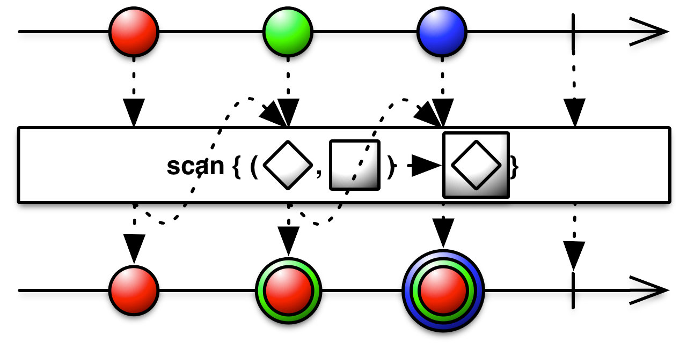

*The simplest things are often the hardest to learn. Our experience dealing with complicated topics hinders us from switching our brain to comprehend simple things.*

*And no, [marbles](http://rxmarbles.com/) don’t always help. You can find far better metaphors, some of them even in your own fridge.*

---

You probably heard about Reactive programming already. There’s a probability you’ve used **ReactiveX** in your favorite programming language. And chances are, you probably struggled with it in the beginning just like everyone else, wondering why is it so hard.

I was warned at the beginning of my learning process that it is a very complicated topic. Actually, so complicated it takes at least one week to understand the bare basics. And so complicated, that people who already knew it, could not or dared not to explain it verbally.

The truth is, reactive programming and ReactiveX are simple.

---

The problem is the lack of proper understanding and the learning material. Most of the documentation, although well improved over time, is still hard to understand by a complete beginner in the reactive world. The majority of people learned Rx the hard way — by trying out different things and figuring out how it manifests in the results. The hardest part, however, is switching to a **reactive state of mind**. Sadly, some never reach this state. Remember the people from the beginning that could not explain reactiveness because it was ***too complicated***?

## What is ReactiveX?

If you look at some of the documentation at official and not so official websites for Rx you will probably have a big question mark hanging above your head. The language used is often too technical and uses technical terminology to explain that very same terminology.
> ReactiveX is an API for asynchronous programming
with **observable streams**

or
> ReactiveX is a library for a composing asynchronous and event-based programs using **observable sequences**

At some point, developers realized it was too complicated to use words so they decided to use marbles as a metaphor instead. While marbles were clear enough for simple operations, they soon hit the same limits. It’s like trying to use an abacus to explain how integrals work. Just look at the *scan* operator below.



Even if you know how *scan* works, this diagram might not be clear. If you don’t know, on the other hand, there’s zero chance that you’ll understand what’s going on here.

---

So… maybe we are looking at this from the wrong perspective. What if we learned first what reactive programming is?
> **Reactive programming** is a declarative programming paradigm concerned with data streams and the propagation of change

It does not get any better.
> ReactiveX is a combination of the best ideas from
the **Observer pattern**, the **Iterator pattern**, and **functional programming**

Let’s try to decompose this definition. Instead of marbles, let’s try using real-world examples… for example — food. Learning things *“by analogy”* is one of the easiest ways to learn.

---

## Functional programming

Maybe the best way to explain what functional programming is is by explaining what functional programming isn’t. Let’s analyze a basic **scrambled eggs** recipe in an iterative way:

```
1. Assemble:
    2 eggs;
    1 teaspoon of butter or oil;
    dash of pepper;
    1/8 teaspoon of salt;
2. Beat eggs, salt, pepper in a bowl.
3. Heat butter in (omelet) pan over medium-high heat until hot.
4. Pour in the egg mixture.
5. Stir mixture until all the parts have thickened.
6. Serve your meal.
```


This recipe was designed for one person and is considered a sealed process. It does not explain the dependencies between steps. For instance, if we need to make two or more portions, which steps could be done in parallel? Do we need two pans and two stoves? What if we forgot the pepper? Can we add it later? All those situations happen quite regularly in the kitchen, but also happen to correspond to the things we do in programming — parallelizing processes, reusing resources, shuffling the order of computation, dealing with failures…

Let’s see now how we would do this functionally.

    serve(
      stir(
        heat(butter, pan, "medium-heat"),
        beat(eggs, salt, pepper),
        hasTickened == true
      )
    )

It’s now a bit clear that heating the butter in the pan and beating the eggs can be parallelized. We also see that we should only serve once** **the mixture had thickened. Also, we must stir the mixture in the medium heated pan until thickened.

If we consider that stirring the mixture does the same thing as beating (mixing) them we could even do this:

    serve(
      stir(
        heat(butter, pan, "medium-heat"),
        $ingredients,
        hasTickened == true
      )
    )

We mark the second param, the ingredients, with a dollar sign to note that it’s a stream of items. It also tells us that as long as the mixture hasn’t thickened we can still add spices or more eggs to the ingredients stream. We can see the dependencies, hierarchy and a clear flow — something enters the function, something (else) exits the function.

While not always applicable in the kitchen, in functional programming functions should be always pure:
* have no side effects (e.g. heating the pan will not melt ice-cream in your freezer)
* input parameters are not mutated, functions return new objects (this would require eggs to remain intact after stirring)

## Iterator pattern

The iterator pattern is one of the original [**Gang of Four** design patterns](https://en.wikipedia.org/wiki/Design_Patterns) along with the observer pattern. In order to understand how iterator works, we can imagine a pizza.


Your pizza works according to the iterator pattern. You take one slice, then take another one, and another one… until there are no more slices left. At any time you can ask (or rather look at) pizza to find out are there more slices available. Iterator helps you to iterate over a collection of items — in this case, a collection of pizza slices. It could be an “endless” collection — like pouring a glass of tap water.

## Observer pattern

While pizza required you to do some manual labor — taking the slices, observer requires you to just “subscribe” to pizza and the slices will come to you. But, maybe pizza is not the best metaphor here.


Imagine coming to your grandmother and saying: “Hey, grandma, I am hungry”. And suddenly, faster than the rocket, your grandma starts making pancakes. You can sit tight until the first pancake arrives. And soon after the next one will come. If your grandma is like mine, eventually you’ll have to say: “I’m full”, otherwise the pancakes will be coming endlessly.

The process of making pancakes can actually explain a lot of RX operators:

* **buffering** pancakes next to the stove and then bringing you a bunch
* **mapping** pancake with jam
* **filtering** out burned pancakes

---

## Hot and cold observables

Everything can be an Observable. Observable is an object to which an observer can subscribe. An item, next to you, is an Observable . In our example, pancake-making-grandma is an Observable. Just like pizza, it exposes a collection of items. We can apply multiple functions (called operators) upon observable responses to further enhance or shape the output we need.

You might notice two sub-classes here — some observables are a one-time thing, while others come in a stream, but they generally work the same way — you request something (or some things) and you receive it once it’s ready. You can also unsubscribe before the next item arrives.

Some observables, however, produce items regardless of whether you asked for them or not.


Imagine going to a Japanese restaurant and ordering sushi. Your sushi does not exist up front. It is being made for you once you order it (subscribe to it). You have a window of opportunity, where you might cancel the order if you change your mind. This type of observable is called **cold **observable. The most common example is fetching data from the server.

Now imagine a [conveyor belt sushi](https://en.wikipedia.org/wiki/Conveyor_belt_sushi) (also known as the running sushi, or sushi train) restaurant. Cooks prepare sushi the whole day, and ready-made sushi rotates on a track for customers to pick. The sushi was there before you arrived and will be coming out of the kitchen even after you leave. It does not wait for your “subscription”. You can unsubscribe (stop eating) but that won’t stop the production. This is called **hot **observable. The most common example is listening to mouse events.

## Food for thought

Now once you’ve mastered the basics of ReactiveX, select your favorite operator or observable and try to find an analogy in your surrounding.

---

Used materials:

* [http://reactivex.io/](http://reactivex.io/)
* [https://www.learnrxjs.io/](https://www.learnrxjs.io/)
* [https://en.wikipedia.org/wiki/Reactive_programming](https://en.wikipedia.org/wiki/Reactive_programming)
* [https://frontendmasters.com/courses/asynchronous-javascript/](https://frontendmasters.com/courses/asynchronous-javascript/)
