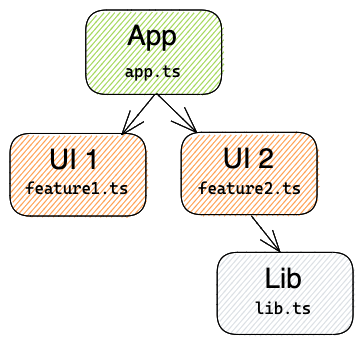
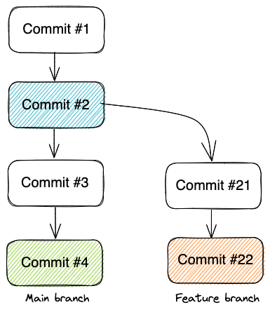

One of the most exciting features of [Nx](https://nx.dev/) is using the **project graph** to run the target commands. This article exposes a bit of magic behind the **affected** commands, explains the common use cases, and shows you how to effectively use them in your Continuous Integration (CI) environment. Finally, we will present you with two CI utilities we created recently that will help you solve this issue.

---

## The affected commands in a nutshell

This feature saves tremendous processing time by running a target only on the projects that were affected by the change. But it's not always trivial what to choose as a reference point for change detection.

Let's assume our solution consists of one application, two UI libraries, and one utility library. The application uses both UI libraries and the second UI library uses the utility library. The graph for this structure looks something like this:



If we were to modify `app.ts` only the application would be affected. However, if we change `lib.ts` then not only would the utility library be affected, but also `UI 2` and `App`. The affected command encapsulates the logic of detecting which project nodes were affected by the change.

The command has a simple form:

```bash
nx affected --target={your chosen target e.g. "test"} {...options}
```

The target is defined in the `workspace.json` (lint, test, build...). Affected has several handy options, such as `parallel` (to run tasks sequentially or in parallel), but the two most important ones are `base` and `head`. They are essential in providing information about the scope of the change. 

Here's our Egghead tutorial showing the Nx affected commands in action:

[https://egghead.io/lessons/javascript-scale-ci-runs-with-nx-affected-commands](https://egghead.io/lessons/javascript-scale-ci-runs-with-nx-affected-commands)

## Change detection logic

Let's look at this excerpt showing the logic for detecting which files were changed:

```tsx
if (files) {
  return { files };
} else if (uncommitted) {
  return { files: getUncommittedFiles() };
} else if (untracked) {
  return { files: getUntrackedFiles() };
} else if (base && head) {
  return { files: getFilesUsingBaseAndHead(base, head) };
} else if (base) {
  return {
    files: Array.from(
      new Set([
        ...getFilesUsingBaseAndHead(base, 'HEAD'),
        ...getUncommittedFiles(),
        ...getUntrackedFiles(),
      ])
    ),
  }
```

If the user explicitly provided a list of `files` or requested only `uncommitted` or `untracked`files, then only these files would be used to detect affected projects. We can also see, that if `head` is not provided, the default value `HEAD` will be used. A side-effect effect of not providing the head is that **affected** logic will also check for untracked and uncommitted files. Obviously, this only makes sense locally where you expect some untracked or uncommitted changes.

  
Let's see now what `base` defaults to:

```jsx
base = nxJson.affected?.defaultBase || 'master';
```

We use `git merge-base` to find all the files changed between the `base` and the `head`:

- If you are running affected on a branch, it will compare the point where the branch was created with the latest commit in the branch along with any of your uncommitted changes



On the diagram above, when we run `nx affected` (or `nx affected --base=main --head=HEAD`) we are comparing are all the files changed between commits #22 (orange) and #2 (blue). 

- If you are running affected on the main branch, your base and head points to the same commit. The most obvious choice for main branch would be to use **HEAD~1** as base:

```bash
nx affected --target={target} --base=HEAD~1 --head=HEAD
```

which compares the latest commit with the previous one.

## The problem

Take the above commit graph as an example. Our CI runs `nx affected --target=build` ****on each new commit. Let's assume that **commit #3** contained a code that broke the `Lib`'s build and now our main branch is in broken state. Another developer pushed the commit #4 that only changes the `UI 2`. Running affected would compare commits #3 and #4 and would run targets only on the `App` and `UI 2`. The CI would falsely report that the main branch is now fixed, because the last check was successful. 

The commits therefore can't just be `HEAD` and `HEAD~1`. If a few workflows fail one after another, that means that we're accumulating a list of affected projects that are potentially still broken. 

## The solution

We want to include **every commit since the last time we had a successful run**. That way we ensure we don't accidentally skip checking the broken project. What we essentially want is to use the last *successful* commit on main branch as the `base`:

```bash
nx affected --target={target} --base={last successful commit} --head=HEAD
```

Luckily most of the CI platforms already provide APIs needed to detect the last successful runs, and using `git` we can extract the exact commits.

---

## CircleCI Orb and GitHub Action

When using **affected** in our CI platforms, the usual steps in our pipelines are:

1. Checkout the code
2. Install dependencies
3. Run the command(s)

Most likely we would have two separate workflows/pipelines - one for the main branch using `HEAD~1` as base and one for the PR branches using main branch as the base. We want to inject another step before the run command that would find the last successful commit and store it in the environment variable so that affected commands can use it.

For CircleCI we created the [nrwl/nx](https://circleci.com/developer/orbs/orb/nrwl/nx) orb that includes a useful `set-shas` command for deriving commit SHAs of HEAD and last successful commit:

```yaml
version: "2.1"
orbs:
    nx: nrwl/nx@1.0.0
jobs:
    build:
        docker:
            - image: cimg/node:14.17-browsers
        steps:
            # ...CI steps like checkout, install...

            - nx/set-shas
            - run:
                command: nx affected --target=build --base=$NX_BASE

            # ...other CI steps
```

Similarly, on GitHub we provide [nx-set-shas](https://github.com/marketplace/actions/nx-set-shas) action that gives equal functionality for GitHub workflows:

```yaml
jobs:
  check:
    runs-on: ubuntu-latest
    name: Check branch
    steps:
      # ...CI steps like checkout, install...

      - name: Derive appropriate SHAs for base and head for `nx affected` commands
        uses: nrwl/nx-set-shas@v2

      - run: nx affected --target=build --base=${{ env.NX_HEAD }}

      # ...other CI steps
```

---

## Summary

Using affected can speed up your computation times but unless you use it properly it can also be a source of escaped issues.

In this post we looked at how the affected command works and how to use it, and what is the common issue when using it on the CI. 

Our [CircleCI orb](https://circleci.com/developer/orbs/orb/nrwl/nx) and [Github Action](https://github.com/marketplace/actions/nx-set-shas) helps you to compare always against the last successful build and make sure you protect against breakages from committed code.
