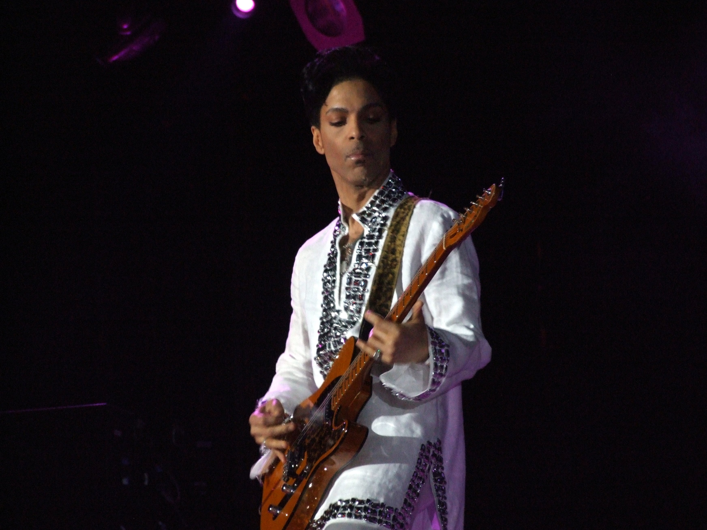

Almost every company working with the web today is looking for full stack developers. Developers, as a direct consequence, try to represent themselves as a full stack developer adding a little bit of front-end and a little bit of back-end to their CV. But are they really? And more important — does the company actually need a full stack developer?

*Hiring a developer is like scouting a new band member. You are looking for someone with a specific skill, who will match your spirit, doesn’t have a band already or is willing to change a band for the perks you are offering.*

*If your band is famous, musicians will be queuing to join you. If you’re a small local band, your choices are unfortunately limited. So you better be sure you know who you’re looking for and whether you can afford them.*

---

Every musician starts as a “full stack”. That’s the only way you can practice and learn. You find one instrument you want to play, and since you don’t have a band, you have to sing, play or hum the melody and give yourself a rhythm. You have to be a one-man band. It’s not that seldom that musician changes an instrument he/she started with originally at a later point because of the demand or simply because they realized it suits them better.

Some musicians remain “full stack” throughout their career. If they become composers, they play multiple different instruments while composing a new piece. A band needs at least one. Some musicians are simply **musical geniuses** and play with the same degree of virtuosity on multiple instruments.

[Prince](https://en.wikipedia.org/wiki/Prince_(musician)) was one of them. On his first album, he played all 27 instruments. [Damon Albarn](https://en.wikipedia.org/wiki/Damon_Albarn) and [Phil Collins](https://en.wikipedia.org/wiki/Phil_Collins) also play several instruments.

---

A full stack developer is someone who works on front-end, services, database, and devops — the entire application’s stack. A good full stack developer is proficient on all those stacks. A great one has several years of parallel professional experience in all of them.

In my career, I have met a few people who I consider to be good (some even great) full stack developers. Yet, most of them would say they prefer one tier over others.

I have also met considerably more great front-end and back-end developers who can work across tiers and are not afraid to own the whole vertical — from database to front-end. You can count on them when you need help in the stack they are not expert in. But their expertise lies somewhere else. Therefore, they do not see themselves as full stack developers.

---

Just like probably everyone else out there, at the beginning of my career, I have worked as a full stack developer working across an entire vertical. At some point, I realized I prefer front-end over other layers and decided I want to focus on it. I still do some work on the back-end or database when needed. I also deploy my apps as part of my daily work. When it comes to my private projects, I’m a one-man show. But if you ask me what kind of a developer I am, I will tell you — I am a front-end developer.

Most of the developers are like me. They can work on every part of the application when needed but they are best in their area of specialty. And just like those musicians, we can learn any new concept, any new framework, any new programming language should we be given enough time and more importantly — a reason.

---

While most of the companies looking for a full stack developer hope to hire the next **Prince** or **Phil Collins**, most of them cannot afford or simply do not have a band that is exciting enough for such artists. Instead, they end up with someone like this guy:

Don’t get me wrong, I’m sure this guy is super talented. 
But ask yourself this — if you were a **band manager**, would you bring a couple of those guys to play in your band, or would you rather find the best singer, best guitar player, best drummer, best (chose your instrument) that you can afford? Because that best guitar player can for sure sing or play drums on a decent level if needed. After all, no one wants a musician who doesn’t care for the rest of the composition.

---

Do you really **need** a team of full-stack developers, or do you actually want developers who are amazing in their specialty area, knowledgeable in others and play well together? Because latter may not necessarily see themselves as full stack developers.
